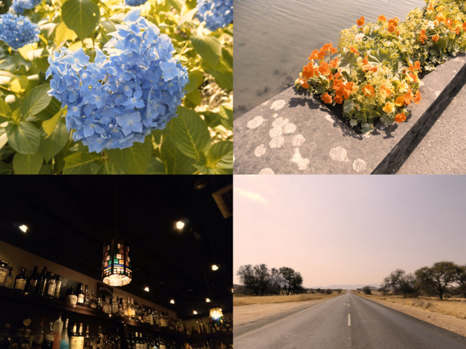
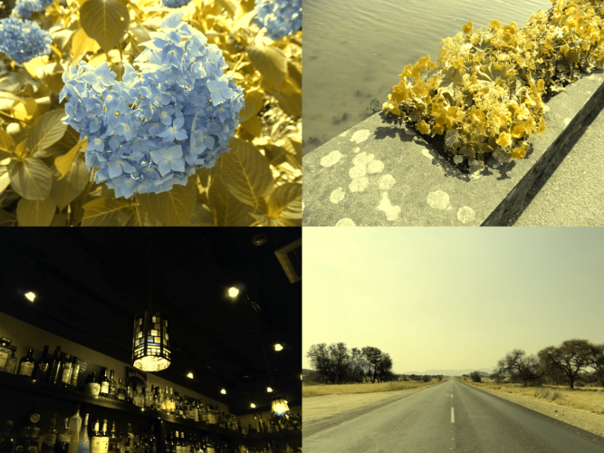
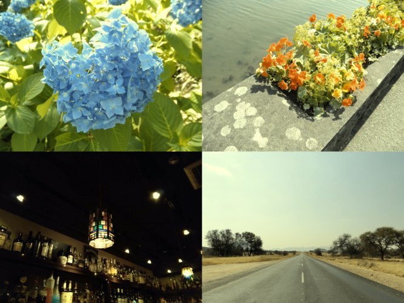
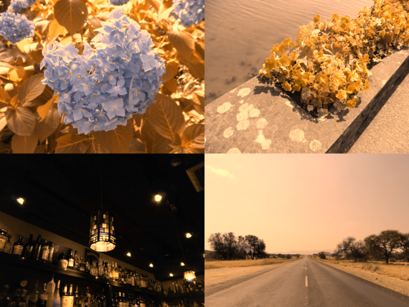
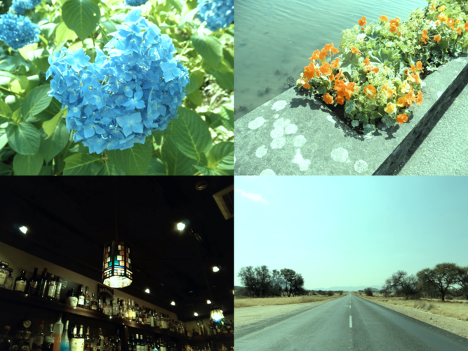
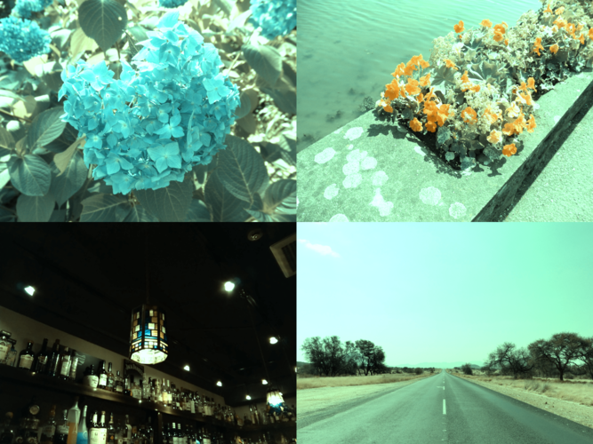
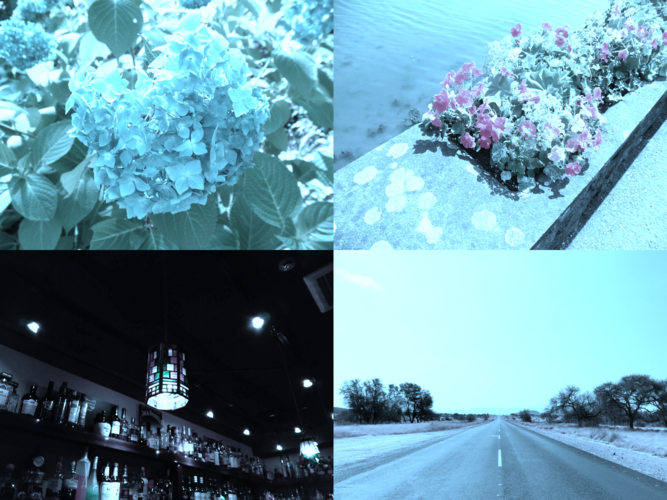
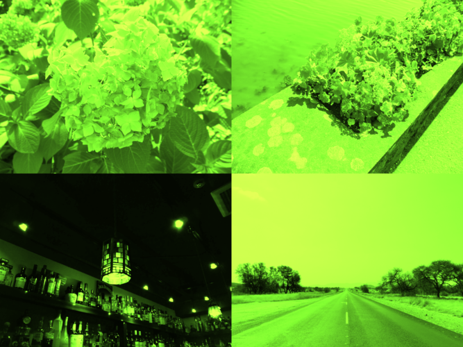

# Colorverse

Color vision convertor

## Usage

Configure:

```console
$ cargo add colorverse
```

Use:

```rust
use colorverse::convert;

let color_vision = ColorVision::Protanopia;
let input_file_path = "input.png";
let output_file_path = format!("output-{}.png", color_vision);

convert(input_file_path, &color_vision)
    .unwrap()
    .save_as(output_file_path.as_str());
```

```rust
use colorverse::convert;

let mut color_vision_iterator = ColorVisionIterator::new(&ColorVision::Trichromacy);
while let Some(color_vision) = color_vision_iterator.next() {
    match convert("input.png", &color_vision) {
        Ok(x) => {
            let output_file_path = format!("output-{}.png", &color_vision);
            x.save_as(output_file_path.as_str());
        }
        Err(err) => eprintln!("{}", err),
    }
}
```

## Samples

### Trichromacy


### Protanomaly



### Protanopia



### Deuteranomaly



### Deuteranopia



### Tritanomaly



### Tritanopia



### Achromatomaly



### Achromatopsia


