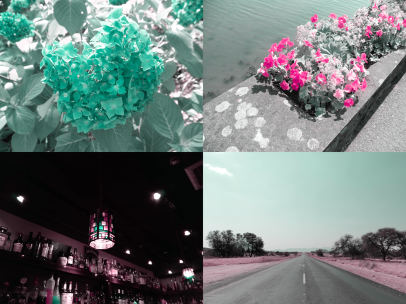

# Colorverse

Color vision diversity (色覚多様性) convertor - not only simulate but also daltonize (色の補正)

[](https://crates.io/crates/colorverse)
[](https://docs.rs/colorverse)
[](https://deps.rs/crate/colorverse)
[](https://github.com/accessible-colors/colorverse/actions/workflows/release-executable.yaml)
[](https://github.com/accessible-colors/colorverse/blob/main/LICENSE)

Based on [Machado, Oliveira & Fernandes (2009)](https://www.inf.ufrgs.br/~oliveira/pubs_files/CVD_Simulation/CVD_Simulation.html) model.
Customized with dynamic simulation level parameter introduced and nonlinear easing of the level.

## Usage

### Executable

Executables on multiple platforms are found in [Releases](https://github.com/accessible-colors/colorverse/releases/latest). Just run it without any installation.

```console
$ # usage
$ ./colorverse simulate -c ${color vision} -l ${simulation level} -o ${output file path} ${input file path}
$ ./colorverse daltonize -c ${color vision} -l ${simulation level} -s {daltonization strength} -o ${output file path} ${input file path}

$ # for example
$ ./colorverse simulate -c protanomaly -l 0.75 -o simulate-out.png in.png
$ ./colorverse daltonize -c deuteranomaly -l 1.0 -s 1.0 -o daltonize-out.png in.png

$ # help
$ ./colorverse --help
$ ./colorverse simulate --help
$ ./colorverse daltonize --help
```

### Rust and `cargo`

See [docs/DEVELOPMENT.md](docs/DEVELOPMENT.md).

---

## Samples

### Trichromacy


### Protanomaly

#### Simulation 50%


#### Simulation 100% (Protanopia)


#### Simulation 100% + Daltonization 50%


#### Simulation 100% + Daltonization 100%


### Deuteranomaly

#### Simulation 50%


### Simulation 100% (Deuteranopia)


#### Simulation 100% + Daltonization 50%


#### Simulation 100% + Daltonization 100%


### Tritanomaly

#### Simulation 50%


### Simulation 100% (Tritanopia)



#### Simulation 100% + Daltonization 50%


#### Simulation 100% + Daltonization 100%


### Achromatomaly

#### Simulation 50%


### Simulation 100% (Achromatopsia)


---

## Open-source, with care

This project is lovingly built and maintained by volunteers.  
We hope it helps streamline your work.  
Please understand that the project has its own direction — while we welcome feedback, it might not fit every edge case 🌱

## Acknowledgements

Depends on [image](https://github.com/image-rs/image) / [nalgebra](https://github.com/dimforge/nalgebra).
Also, on [argh](https://github.com/google/argh) on CLI I/F.
