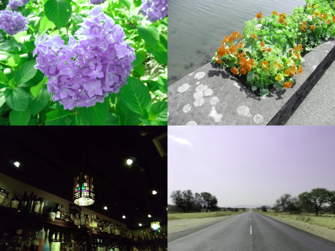

# Colorverse

Color vision convertor / simluator

## Usage

Configure:

```console
$ cargo add colorverse
```

Use:

```rust
use colorverse::convert;
use colorverse::core::color_vision::color_vision_type::ColorVisionType;

let color_vision_type = ColorVisionType::Protanomaly;
let level = 0.5;
let input_file_path = "input.png";
let output_file_path = format!("output-{}-{}.png", color_vision, level * 100.0);

convert(input_file_path, &color_vision, level)
    .unwrap()
    .save_as(output_file_path.as_str());
```

```rust
use colorverse::convert;
use colorverse::core::color_vision::color_vision_type::ColorVisionType;

let mut color_vision_type_iterator = ColorVisionTypeIterator::new(&ColorVisionType::Trichromacy);
while let Some(color_vision_type) = color_vision_type_iterator.next() {
    for level in [0.5, 1.0] {
        match convert("input.png", &color_vision_type, level) {
            Ok(x) => {
                let output_file_path = format!("output-{}-{}.png", &color_vision_type, level * 100.0);
                x.save_as(output_file_path.as_str());
            }
            Err(err) => eprintln!("{}", err),
        }
    }
}
```

## Samples

### Trichromacy


### Protanomaly 50%



### Protanomaly 100% (Protanopia)


### Deuteranomaly 50%


### Deuteranomaly 100% (Deuteranopia)


### Tritanomaly 50%


### Tritanomaly 100% (Tritanopia)


### Achromatomaly 50%


### Achromatomaly 100% (Achromatopsia)


