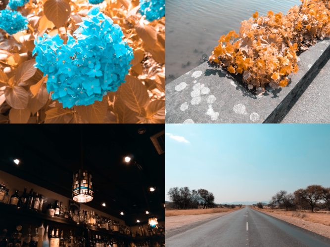
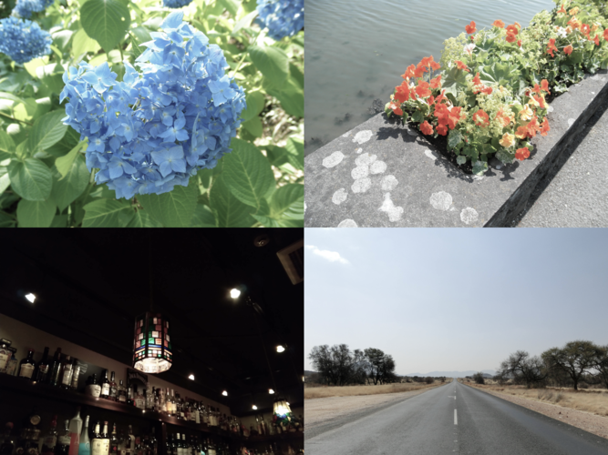

# Colorverse

Color vision convertor: not only simulator but also daltonizer

[](https://crates.io/crates/colorverse)
[](https://docs.rs/colorverse)
[](https://deps.rs/crate/colorverse)
[](https://github.com/nabbisen/colorverse/actions/workflows/release-executable.yaml)
[](https://github.com/nabbisen/colorverse/blob/main/LICENSE)

Based on [Machado, Oliveira & Fernandes (2009)](https://www.inf.ufrgs.br/~oliveira/pubs_files/CVD_Simulation/CVD_Simulation.html) model.
Customized with dynamic simulation level parameter introduced and nonlinear easing of the level.

## Usage

### Executable

Executables on multiple platforms are found in [Releases](https://github.com/nabbisen/colorverse/releases/tag/latest). Just run it without any installation.

```console
$ # usage
$ ./colorverse -c ${color vision} -l ${simulation_level} -o ${output file path} ${input file path}

$ # for example
$ ./colorverse -c protanomaly -l 0.75 -o out.png in.png

$ # help
$ ./colorverse --help
```

### Rust and `cargo`

Configure:

```console
$ cargo add colorverse
```

Use:

```rust
use colorverse::convert;
use colorverse::core::color_vision::color_vision_type::ColorVisionType;

let color_vision_type = ColorVisionType::Protanomaly;
let simulation_level = 0.5;
let input_file_path = "tests/fixtures/input.png";
let output_file_path = format!("output-{}-{}.png", color_vision, simulation_level * 100.0);

convert(input_file_path, &color_vision, simulation_level)
    .unwrap()
    .save_as(output_file_path.as_str());
```

```rust
use colorverse::convert;
use colorverse::core::color_vision::color_vision_type::ColorVisionType;

let mut color_vision_type_iterator = ColorVisionTypeIterator::new(&ColorVisionType::Trichromacy);
while let Some(color_vision_type) = color_vision_type_iterator.next() {
    for simulation_level in [0.5, 1.0] {
        match convert("tests/fixtures/input.png", &color_vision_type, simulation_level) {
            Ok(x) => {
                let output_file_path = format!("output-{}-{}.png", &color_vision_type, simulation_level * 100.0);
                x.save_as(output_file_path.as_str());
            }
            Err(err) => eprintln!("{}", err),
        }
    }
}
```

## Samples

### Trichromacy


### Protanomaly 50%


### Protanomaly 100% (Protanopia)


### Deuteranomaly 50%


### Deuteranomaly 100% (Deuteranopia)



### Tritanomaly 50%


### Tritanomaly 100% (Tritanopia)


### Achromatomaly 50%



### Achromatomaly 100% (Achromatopsia)


---

## Open-source, with care

This project is lovingly built and maintained by volunteers.  
We hope it helps streamline your work.  
Please understand that the project has its own direction — while we welcome feedback, it might not fit every edge case 🌱

## Acknowledgements

Depends on [image](https://github.com/image-rs/image) / [nalgebra](https://github.com/dimforge/nalgebra).
Also, on [argh](https://github.com/google/argh) on CLI I/F.
